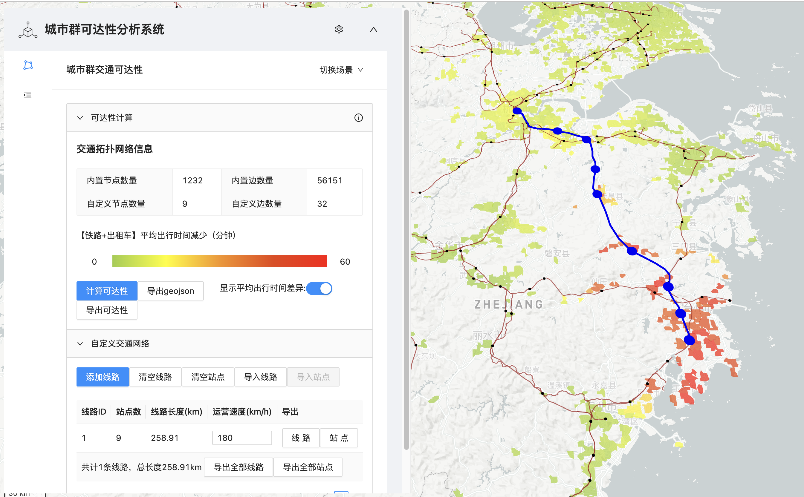

# 城市群可达性分析系统

可交互实时计算的城市群可达性分析系统，快速评估交通基础设施建设所带来的可达性提升。系统链接在[这个页面](https://ni1o1.github.io/UrbanAgglomerationAccessbility/build/)。

## 视频介绍

- [bilibili](https://www.bilibili.com/video/BV19L411K7qr/)
- [Youtube](https://www.youtube.com/watch?v=XNQuhpW0xCg)

## 样例数据

Demo数据存放在[这里](https://github.com/ni1o1/UrbanAgglomerationAccessbility/tree/main/demodata)，将demo数据下载后导入线路与站点即可

## 主要功能

该系统的主要的功能如下：

- **可达性计算**:通过内置的交通网络拓扑模型，快速计算城市群中各级社区的平均出行时间以反映其可达性。
- **自定义交通网络**:支持在地图上绘制任意交通线路，设定沿线站点与线路运营速度，并分析其带来的交通可达性提升。同时支持多条具有不同运营速度的交通线路。通过设定交通线路的运营车速与站点，系统能够评估高铁、动车、地铁、高速公路等交通基础设施的规划对城市群整体交通可达性的提升。
- **数据交互**:扩展性强，支持线路与站点数据的导入与导出，也支持不同分析场景切换。能够将绘制的交通线路与站点以通用地理信息文件的形式导出，以便规划人员在其他GIS平台中使用。通过修改内置的场景文件，系统能够应用于任意地理空间位置不同交通方式下的可达性分析。

## 用什么做的？

编程语言：JavaScript
主要用到的有下面这些包:

- 前端框架：[React.js](http://reactjs.org)
- 组件通信：[PubSubJS](https://github.com/mroderick/PubSubJS)
- UI框架：[AntD](https://ant.design/)
- 地图底图：[React-map-gl](http://visgl.github.io/react-map-gl/docs)
- 地图可视化：[Deck.gl](http://deck.gl)
- 空间计算：[Turf.js](http://turfjs.org/)
- 地图交互绘制：[nebula.gl](https://nebula.gl/)
